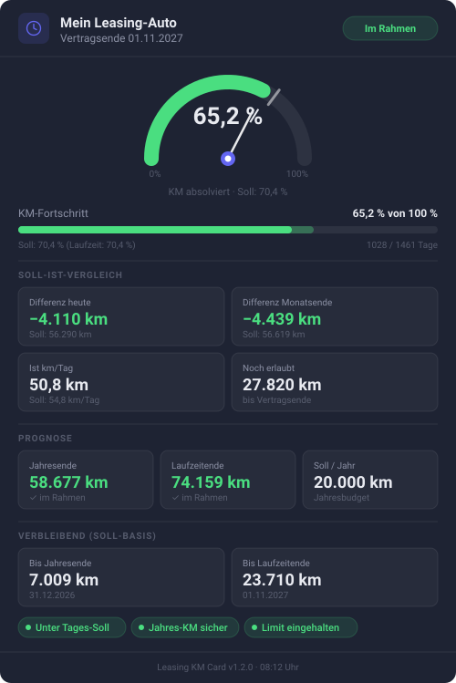

> [!IMPORTANT]
> **Dieses Repository ist archiviert. Die Karte kommt jetzt mit der Integration.**
>
> Die Leasing KM Card ist nach
> [sphings79/leasing-km-home-assistant](https://github.com/sphings79/leasing-km-home-assistant)
> umgezogen. Die Integration liefert sie aus und trägt die Lovelace-Ressource selbst ein, es gibt
> also nichts mehr separat zu installieren.
>
> **Zum Umstieg:** die Integration installieren oder aktualisieren, danach dieses Repository aus
> HACS entfernen und den alten Ressourceneintrag auf `leasing-km-card.js` löschen. Deine Dashboards
> laufen weiter, der Kartentyp bleibt `custom:leasing-km-card`.

<div align="center">


# Leasing KM Card für Home Assistant

**Eine Lovelace-Karte, die die Leasing-Kilometer auf einen Blick zeigt: Gauge, Soll-Ist, Prognose.**

[](https://hacs.xyz)
[](LICENSE)
[](https://www.home-assistant.io)
[](#konfiguration)
[](#sprache)

[English](README.md) · **Deutsch**

</div>

---

## Was diese Karte macht

Die [Integration „Leasing KM-Rechner“](https://github.com/sphings79/km_leasing_check_ha) erzeugt
14 Sensoren und 3 Binärsensoren. Packt man die in eine normale Entities-Karte, bekommt man eine
Liste von Zahlen, die alle gleich wichtig aussehen — und genau das ist das Problem, denn im Alltag
zählen nur zwei davon: *liege ich vor oder hinter dem Soll*, und *wo lande ich am Ende*.

Diese Karte beantwortet beides, ohne dass man etwas lesen muss:

- Ein **Halbkreis-Gauge** zeigt den verbrauchten Anteil des Kilometerkontingents, mit einer
  **Nadel** für den Ist-Wert und einer **Markierung** für das Soll. Nadel links von der Markierung
  heißt: alles im Rahmen.
- Ein **überlagerter Fortschrittsbalken** stellt Ist und Soll auf derselben Bahn dar und wird rot,
  sobald man darüber liegt.
- **Metrik-Kacheln**, gruppiert nach Soll-Ist-Vergleich, Prognose und Restkilometern.
- **Status-Pills** für die drei Binärsensoren, damit eine drohende Überschreitung als Farbe
  sichtbar wird.

Die Karte nutzt die CSS-Variablen von Home Assistant, folgt damit dem eingestellten Theme und
wechselt selbstständig zwischen Hell und Dunkel.

---

## Vorschau

<div align="center">

</div>

> Das ist eine Illustration des Kartenlayouts, kein Foto einer laufenden Instanz.

---

## Voraussetzungen

| Anforderung | Details |
|---|---|
| Home Assistant | 2026.4 oder neuer |
| [Integration „Leasing KM-Rechner“](https://github.com/sphings79/km_leasing_check_ha) | Erforderlich — die Karte stellt ausschließlich deren Entitäten dar |

Die Integration zuerst installieren. Fehlt sie, zeigt die Karte einen entsprechenden Hinweis statt
eines Fehlers.

---

## Installation

### Variante A — HACS (empfohlen)

1. HACS öffnen → **Frontend** → Drei-Punkte-Menü → **Benutzerdefinierte Repositories**
2. URL dieses Repositories eintragen, Kategorie **Lovelace** → **Hinzufügen**
3. Nach **„Leasing KM Card“** suchen und installieren
4. Browser-Cache leeren (Strg + Umschalt + R)

### Variante B — manuell

1. `leasing-km-card.js` nach `config/www/` kopieren
2. In Home Assistant: **Einstellungen → Dashboards → Ressourcen → + Ressource hinzufügen**
3. URL `/local/leasing-km-card.js`, Typ **JavaScript-Modul**
4. Browser-Cache leeren

---

## Konfiguration

Die Karte bringt einen **visuellen Editor** mit — im Karten-Picker auswählen, Instanz wählen,
fertig. Das folgende YAML ist genau das, was der Editor schreibt.

### Minimal

```yaml
type: custom:leasing-km-card
entity_prefix: leasing
```

### Vollständig

```yaml
type: custom:leasing-km-card
entity_prefix: leasing
title: Mein Leasing-Auto
```

### Optionen

| Option | Pflicht | Standard | Beschreibung |
|---|---|---|---|
| `entity_prefix` | ✅ | – | Präfix der Entitäten aus der Integration (z. B. `leasing` → `sensor.leasing_km_absolviert`) |
| `title` | ❌ | `Leasing KM` | Überschrift in der Kartenkopfzeile |

### Das eigene Entity-Präfix finden

Das Präfix ist der Teil der Entitäts-ID nach `sensor.` und vor dem eigentlichen Wertnamen — also
der Slug des Gerätenamens, den man der Integration gegeben hat.

Sehen die Entitäten so aus:

```
sensor.leasing_km_absolviert
sensor.leasing_differenz_heute
binary_sensor.leasing_ueber_soll
```

dann ist das Präfix `leasing`. Bei einem Gerät namens *VW Golf* heißen die Entitäten
`sensor.vw_golf_km_absolviert`, das Präfix ist also `vw_golf`.

Der visuelle Editor erkennt die vorhandenen Instanzen automatisch — von Hand ermitteln muss man
das also selten.

---

## Was die Karte anzeigt

| Bereich | Werte |
|---|---|
| Gauge | Verbrauchter Anteil des Kontingents, Nadel für Ist, Markierung für Soll |
| Fortschrittsbalken | Ist gegen Soll auf einer Bahn, grün im Rahmen, rot darüber |
| Soll-Ist-Vergleich | Differenz heute, Differenz Monatsende, Ist- und Soll-km/Tag, noch erlaubte Kilometer |
| Prognose | Hochrechnung für Jahresende und Laufzeitende sowie das Jahresbudget |
| Verbleibend | Soll-Kilometer bis 31. Dezember und bis Vertragsende |
| Status-Pills | Über Tages-Soll · Jahres-KM gefährdet · Limit überschritten |

---

## Mehrere Fahrzeuge

Pro Fahrzeug eine eigene Karte mit dem jeweiligen `entity_prefix` anlegen:

```yaml
type: custom:leasing-km-card
entity_prefix: vw_golf
title: VW Golf
```

```yaml
type: custom:leasing-km-card
entity_prefix: bmw_3er
title: BMW 3er
```

---

## Sprache

Die Karte folgt der **Sprache der Home-Assistant-Oberfläche**. Jede Beschriftung, die sie zeichnet —
Abschnittsüberschriften, Kennzahlen, Status-Pills, der Editor — gibt es auf **Deutsch und Englisch**;
jede andere Oberflächensprache fällt auf Englisch zurück.

Zahlen, Datums- und Zeitangaben richten sich nach derselben Locale: Eine deutsche Instanz zeigt
`65,2 %` und `1.11.2027`, eine englische `65.2 %` und `11/1/2027`.

Die Entitätsnamen kommen aus der
[Integration](https://github.com/sphings79/km_leasing_check_ha) und sind dort in denselben beiden
Sprachen übersetzt. Die Entitäts-**IDs** bleiben in jeder Sprache gleich — Dashboards und
Automationen funktionieren also weiter, wenn man die Oberflächensprache wechselt.

---

## Theming

Die Karte übernimmt ihre Farben aus den CSS-Variablen von Home Assistant —
`--card-background-color`, `--primary-text-color`, `--secondary-text-color` und
`--ha-card-border-radius` — und fällt auf ihre eigene dunkle Palette zurück, wenn ein Theme diese
nicht definiert. Die Statusfarben (grün, gelb, rot) sind fest, damit „über dem Limit“ in jedem
Theme gleich aussieht.

---

## Häufige Fragen

**Die Karte meldet, die Integration fehle, obwohl sie installiert ist.**
Prüfen, ob `entity_prefix` zu den Entitäten passt. `sensor.leasing_vw_golf_km_absolviert` braucht
das Präfix `leasing_vw_golf`, nicht `leasing`.

**Nach dem Update hat sich nichts geändert.**
Lovelace-Ressourcen werden aggressiv zwischengespeichert. Mit Strg + Umschalt + R neu laden; unter
iOS zusätzlich den Frontend-Cache der Companion-App leeren.

**Kann ich die Karte ohne die Integration nutzen?**
Nein. Sie liest genau deren Entitäten und rechnet selbst nichts aus.

**Warum ist die Nadel links von der Markierung eine gute Nachricht?**
Die Markierung ist der Stand, den der Vertrag vorsieht, die Nadel der tatsächliche Stand. Links
davon heißt: bisher weniger gefahren, als der Vertrag zu diesem Zeitpunkt erlaubt hätte.

---

## Verwandte Projekte

- **[Leasing KM-Rechner](https://github.com/sphings79/km_leasing_check_ha)** — die Integration,
  die die Entitäten für diese Karte liefert.
- **[Weitere Projekte und Tools](https://sphings-dev.de/)**

---

## Changelog

### 1.2.0
- **Deutsche und englische Oberfläche**, passend zur Home-Assistant-Sprache
- Zahlen, Datum und Uhrzeit folgen jetzt der Locale statt immer deutsch zu sein
- Instanz- und Kartentitel werden nach Möglichkeit aus dem Gerätenamen gelesen
- Überlappung der Gauge-Beschriftung mit dem Prozentwert behoben

### 1.0.0
- Erstveröffentlichung
- Halbkreis-Gauge mit Ist-Nadel und Soll-Markierung
- Fortschrittsbalken mit Ist/Soll-Überlagerung
- Vollständiger Metrik-Überblick in vier Abschnitten
- Status-Badges und -Pills für alle drei Binärsensoren
- Visueller Karten-Editor
- Hell/Dunkel-Theming über die CSS-Variablen von Home Assistant

---

---

## Sponsor this project

Diese Tools entstehen in meiner Freizeit und bleiben kostenlos, quelloffen und cloudfrei.
Wenn dir eines davon einen Nachmittag gespart hat, kannst du mir [einen Kaffee ausgeben](https://buymeacoffee.com/sphings).

[](https://buymeacoffee.com/sphings)

## Lizenz

MIT — siehe [LICENSE](LICENSE).
