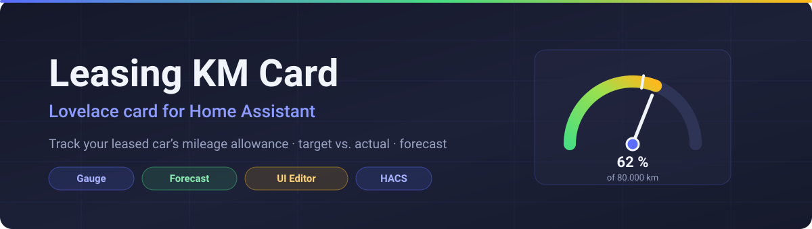
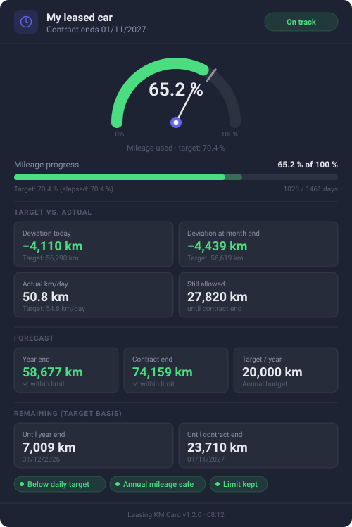

<div align="center">



# Leasing KM Card for Home Assistant

**A Lovelace card that turns your leasing mileage into one glance: gauge, target vs. actual, forecast.**

[](https://hacs.xyz)

[](https://www.home-assistant.io)
[](#configuration)

**English** · [Deutsch](README.de.md)

</div>

---

## What this card does

The [Leasing KM Calculator integration](https://github.com/sphings79/km_leasing_check_ha) produces
14 sensors and 3 binary sensors. Put them in a stock entities card and you get a list of numbers
that all look equally important — which is exactly the problem, because only two of them matter
day to day: *am I ahead or behind*, and *where will I end up*.

This card answers both without reading anything:

- A **semicircular gauge** shows the share of the mileage allowance used, with a **needle** for the
  actual value and a **tick mark** for the target. Needle left of the tick means you are fine.
- A **layered progress bar** puts actual against target on the same track and turns red the moment
  you cross over.
- **Metric tiles**, grouped into target-vs-actual, forecast and remaining kilometres.
- **Status pills** for the three binary sensors, so a looming overrun is visible as colour.

It reads Home Assistant's own CSS variables, so it follows your theme and switches between light
and dark on its own.

---

## Preview

<div align="center">

</div>

> This is an illustration of the card's layout, not a photograph of a running instance.

> **A note on language.** The card's own labels (*Differenz heute*, *Prognose Laufzeitende*, …) are
> **German** and do not currently follow the Home Assistant UI language. The entities behind them
> are named in German by the integration as well; the tables in this README give the English
> meaning of each value.

---

## Requirements

| Requirement | Details |
|---|---|
| Home Assistant | 2026.4 or newer |
| [Leasing KM Calculator integration](https://github.com/sphings79/km_leasing_check_ha) | Required — the card only renders its entities |

Install the integration first. Without it the card shows a hint telling you so, rather than an
error.

---

## Installation

### Option A — HACS (recommended)

1. Open HACS → **Frontend** → three-dot menu → **Custom repositories**
2. Add the URL of this repository, category **Lovelace** → **Add**
3. Search for **“Leasing KM Card”** and install it
4. Empty the browser cache (Ctrl + Shift + R)

### Option B — manual

1. Copy `leasing-km-card.js` into `config/www/`
2. In Home Assistant: **Settings → Dashboards → Resources → + Add resource**
3. URL `/local/leasing-km-card.js`, type **JavaScript module**
4. Empty the browser cache

---

## Configuration

The card ships a **visual editor** — pick it from the card picker, choose the instance, done. The
YAML below is what that editor writes.

### Minimal

```yaml
type: custom:leasing-km-card
entity_prefix: leasing
```

### Full

```yaml
type: custom:leasing-km-card
entity_prefix: leasing
title: My leased car
```

### Options

| Option | Required | Default | Description |
|---|---|---|---|
| `entity_prefix` | ✅ | – | Prefix of the integration's entities (e.g. `leasing` → `sensor.leasing_km_absolviert`) |
| `title` | ❌ | `Leasing KM` | Heading shown in the card header |

### Finding your entity prefix

The prefix is the part of the entity ID after `sensor.` and before the value's own name — in other
words, the slug of the device name you gave the integration.

If your entities look like this:

```
sensor.leasing_km_absolviert
sensor.leasing_differenz_heute
binary_sensor.leasing_ueber_soll
```

then the prefix is `leasing`. For a device named *VW Golf* the entities become
`sensor.vw_golf_km_absolviert` and the prefix is `vw_golf`.

The visual editor detects the configured instances automatically, so you rarely have to work this
out by hand.

---

## What the card shows

| Area | Values |
|---|---|
| Gauge | Share of the allowance used, with a needle for actual and a tick for target |
| Progress bar | Actual against target on one track, green while within the contract, red beyond it |
| Target vs. actual | Deviation today, deviation at month end, actual and target km/day, kilometres still allowed |
| Forecast | Projection for the end of the year and the end of the contract, plus the annual budget |
| Remaining | Target kilometres left until 31 December and until the contract ends |
| Status pills | Above daily target · annual mileage at risk · contract limit exceeded |

---

## Several vehicles

Add one card per vehicle, each with its own `entity_prefix`:

```yaml
type: custom:leasing-km-card
entity_prefix: vw_golf
title: VW Golf
```

```yaml
type: custom:leasing-km-card
entity_prefix: bmw_3er
title: BMW 3 Series
```

---

## Theming

The card takes its colours from Home Assistant's CSS variables — `--card-background-color`,
`--primary-text-color`, `--secondary-text-color` and `--ha-card-border-radius` — and falls back to
its own dark palette if a theme does not define them. Status colours (green, amber, red) are fixed
so that "over the limit" reads the same in every theme.

---

## FAQ

**The card says the integration is missing, but I installed it.**
Check that `entity_prefix` matches your entities. `sensor.leasing_vw_golf_km_absolviert` needs the
prefix `leasing_vw_golf`, not `leasing`.

**Nothing changed after updating.**
Lovelace resources are cached aggressively. Reload with Ctrl + Shift + R; on iOS, clear the
companion app's frontend cache.

**Can I use this card without the integration?**
No. It reads that integration's specific entities and does not compute anything itself.

**Why is the needle to the left of the tick mark a good thing?**
The tick is where the contract says you should be, the needle is where you actually are. Needle to
the left means you have driven fewer kilometres than the contract allowed by now.

---

## Related

- **[Leasing KM Calculator](https://github.com/sphings79/km_leasing_check_ha)** — the integration
  that provides the entities this card renders.
- **[More projects and tools](https://sphings-dev.de/)**

---

## Changelog

### 1.0.0
- First release
- Semicircular gauge with actual needle and target tick
- Layered progress bar for actual vs. target
- Full metric overview in four sections
- Status badges and pills for all three binary sensors
- Visual card editor
- Dark/light theming via Home Assistant CSS variables

---

## License

MIT.
